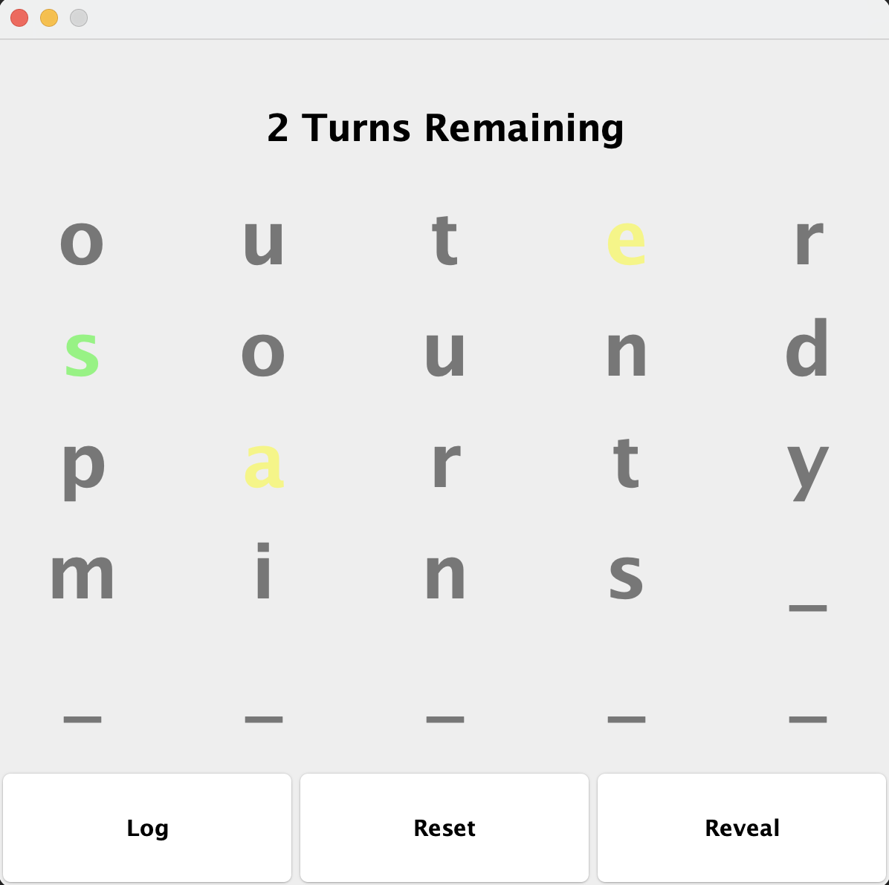

# Infinite-Wordle
## Overview
This is a Java program that simulates a game similar to Wordle. In this game, you can play as many rounds as you want, and a random word is generated for each session. The objective is to guess the word within a limited number of attempts.

## Features
- Generates a random word for each game session.
- (log) button to track sessions. Located@(./src/resources/log.txt)
- (reveal) button for cheating purposes.
- Provides feedback on your guesses, indicating which letters are correct and in the correct position and which letters are correct but in the wrong position.
- Offers the option to play as many rounds as desired.
- Larger word pool than typical wordle allowing for highest skill ceiling.

### Green: The letter is in the word and in the right posotion.
### Yellow: The letter is in the word but in the wrong spot.
### Grey: The letter is not in the word.

